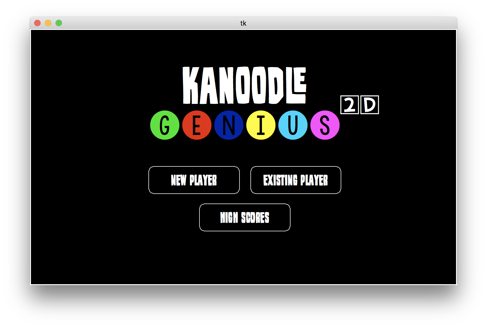

Kanoodle Genius 2D
==================

.. image:: https://travis-ci.org/wkeeling/kanoodlegenius2d.svg?branch=master
    :target: https://travis-ci.org/wkeeling/kanoodlegenius2d

An electronic version of the excellent `Kanoodle Genius <https://www.educationalinsights.com/product/kanoodle--174-+genius.do>`_. Kanoodle Genius 2D is written in Python using Tkinter.

Play on the desktop
--------------------

.. image:: docs/images/sequence.gif
    :align: center

|
|

Play on the Raspberry PI touchscreen
------------------------------------

Kanoodle Genius 2D has been optimised for the `Raspberry PI touch display <https://www.raspberrypi.org/products/raspberry-pi-touch-display/>`_.

.. image:: docs/images/rasp.gif
    :align: center